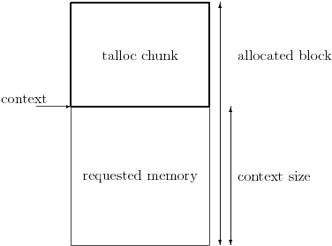
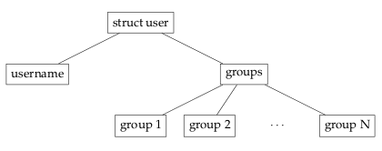

## 1 Talloc context

### 1.1 Talloc 上下文

talloc context 是这个库中最重要的部分，负责这个内存分配器的每一个功能。它是一个逻辑单元，表示由 talloc 管理的内存空间。

从程序员的角度来看，talloc context 完全等同于一个指针，该指针将由 C 标准库中的内存例程返回。这意味着从 talloc 库返回的每个上下文都可以直接用于内部不使用 talloc 的函数。例如，我们可以执行以下操作：

```c
char *str1 = strdup("I am NOT a talloc context");
char *str2 = talloc_strdup(NULL, "I AM a talloc context");

printf("%d\n", strcmp(str1, str2) == 0);

free(str1);
talloc_free(str2); /* we can not use free() on str2 */
```

这是可能的，因为上下文在内部被处理为一个特殊的固定长度结构，称为talloc chunk。每个块存储上下文元数据，然后是程序员请求的内存空间。当 talloc 函数返回上下文（指针）时，它实际上会返回一个指向talloc 块的用户空间部分的指针。如果我们使用 talloc 函数来操作这个上下文，talloc 库会将用户空间指针转换回块的起始地址。这也是我们在上一个例子中无法使用 free（str2）的原因，因为 str2 不指向分配的内存块的开头。如下图所示：



TALLOC_CTX 类型在 talloc.h中 定义，用于识别函数参数中的 TALLOC 上下文。然而，这种类型只是 void 的别名，只存在于语义上的原因——因此我们可以区分 void*（任意数据）和 TALLOC_CTX*（TALLOC 上下文）。

#### 1.1.1 上下文元数据

每个 talloc 上下文都携带了几条内部信息以及分配的内存：
- 名称 - 用于上下文层次结构的报告和模拟动态类型系统，
- 请求内存的大小（以字节为单位）- 这可以用于确定数组中的元素数量，
- 附加的析构函数 - 在内存块即将释放之前执行，
- 对上下文的引用
- 子上下文和父上下文 - 创建内存的层次视图。

### 1.2 talloc 上下文的层次结构

每个 talloc 上下文都包含有关其父级和子级的信息。Talloc 使用这些信息来创建内存的层次模型，或者更准确地说，它创建了一个 n 元树，其中每个节点代表一个 Talloc 上下文。树的根节点被称为顶级上下文 —— 一个没有任何父级的上下文。

这种方法有几个优点：
- 由于释放了 talloc 上下文，它的所有子上下文也将被正确地释放，
- 上下文的父上下文可以随时更改，这导致将整个子树移动到另一个节点下，
- 它创建了一种更自然的数据结构管理方式。

#### 1.2.1 实例

我们有一个存储用户基本信息的结构——他/她的姓名、身份号码和他/她所属的组：

```c
struct user {
  uid_t uid;
  char *username;
  size_t num_groups;
  char **groups;
};
```
我们将使用 talloc 分配此结构。结果将是以下上下文树：



```c
/* create new top level context */
struct user *user = talloc(NULL, struct user);

user->uid = 1000;
user->num_groups = N;

/* make user the parent of following contexts */
user->username = talloc_strdup(user, "Test user");
user->groups = talloc_array(user, char*, user->num_groups);

for (i = 0; i < user->num_groups; i++) {
  /* make user->groups the parent of following context */
  user->groups[i] = talloc_asprintf(user->groups,
                                    "Test group %d", i);
}
```

通过这种方式，我们获得了许多额外的功能，其中之一是非常简单的结构及其所有元素的释放。

使用 c 标准库，我们首先需要对组数组进行迭代，并分别释放每个元素。然后我们必须解除分配存储它们的数组。接下来，我们释放用户名，并作为最后一步释放结构本身。但是对于 talloc，我们唯一需要执行的操作就是释放结构上下文。它的后代将自动释放。

```c
talloc_free(user)；
```

### 1.3 永远保持平稳！

talloc 是一个层次结构内存分配器。层次结构的性质使编程更加防错。它使内存更易于管理和释放。因此，我们首先应该考虑的是：**始终将我们的数据结构投影到 talloc 上下文层次结构中。**

这意味着，如果我们有一个结构，我们应该始终将其用作其元素的父上下文。这样，在释放此结构或更改其父结构时，我们就不会遇到任何麻烦。同样的规则也适用于数组。

### 1.4 创建 talloc 上下文

以下是创建新的 talloc 上下文的最重要的函数。

#### 1.4.1 类型安全功能

它分配给定类型所需的大小，并返回一个新的、正确铸造的指针。这是创建新上下文的首选方式，因为我们可以依靠编译器来检测类型不匹配。

上下文的名称会自动设置为用于模拟动态类型系统的数据类型的名称。

```c
struct user *user = talloc(ctx, struct user);

/* initialize to default values */
user->uid = 0;
user->name = NULL;
user->num_groups = 0;
user->groups = NULL;

/* or we can achieve the same result with */
struct user *user_zero = talloc_zero(ctx, struct user);
```
#### 1.4.2 零长度上下文

零长度上下文基本上是一个没有任何特殊语义的上下文。我们可以像使用其他上下文一样使用它。唯一的区别是，它只由关于上下文的元数据组成。因此，它严格属于 TALLOC_CTX* 类型。它通常用于我们希望在一个父（零长度）上下文下聚合多个数据结构的情况，例如临时上下文，以包含调用方不感兴趣的单个函数中所需的内存。在零长度的临时上下文上进行分配将使函数的清理更加简单。

```c
TALLOC_CTX *tmp_ctx = NULL;
struct foo *foo = NULL;
struct bar *bar = NULL;

/* new zero-length top level context */
tmp_ctx = talloc_new(NULL);
if (tmp_ctx == NULL) {
  return ENOMEM;
}

foo = talloc(tmp_ctx, struct foo);
bar = talloc(tmp_ctx, struct bar);

/* free everything at once */
talloc_free(tmp_ctx);
```

