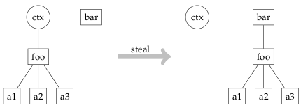

## 2 Stealing a context

### 2.1 窃取上下文

Talloc 能够将 Talloc 上下文的父级更改为另一个父级。这种操作通常被称为偷窃，是在 talloc 上下文中执行的最重要的操作之一。

如果我们希望指针的寿命超过创建它的上下文，那么窃取上下文是必要的。这有很多可能的用例，例如，将数据库搜索的结果窃取到内存缓存上下文，将泛型结构的字段的父级更改为更特定的字段，反之亦然。至少在 Samba 中，最常见的场景是将特定于函数的上下文中的输出数据窃取到作为该函数参数给定的输出上下文中。

```C
struct foo {
    char *a1;
    char *a2;
    char *a3;
};

struct bar {
    char *wurst;
    struct foo *foo;
};

struct foo *foo = talloc_zero(ctx, struct foo);
foo->a1 = talloc_strdup(foo, "a1");
foo->a2 = talloc_strdup(foo, "a2");
foo->a3 = talloc_strdup(foo, "a3");

struct bar *bar = talloc_zero(NULL, struct bar);
/* change parent of foo from ctx to bar */
bar->foo = talloc_steal(bar, foo);

/* or do the same but assign foo = NULL */
bar->foo = talloc_move(bar, &foo);
```

talloc_move() 函数类似于 talloc_steal() 函数，但另外将源指针设置为NULL。

通常，源指针本身不会发生更改（它只替换元数据中的父指针）。但常见的用法是将结果分配给另一个变量，因此除非必要，否则应避免从原始变量进一步访问指针。在这种情况下，talloc_move() 是窃取上下文的首选方式。此外，将源指针设置为 NULL，thus. 保护指针在其父变量更改后不会被意外释放和使用旧变量访问。



